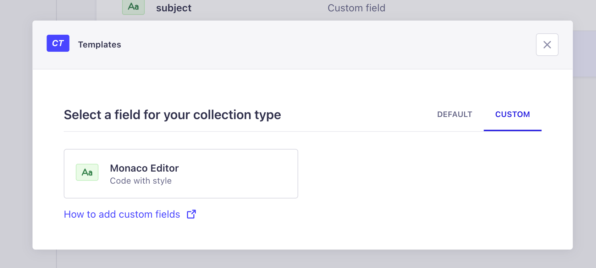
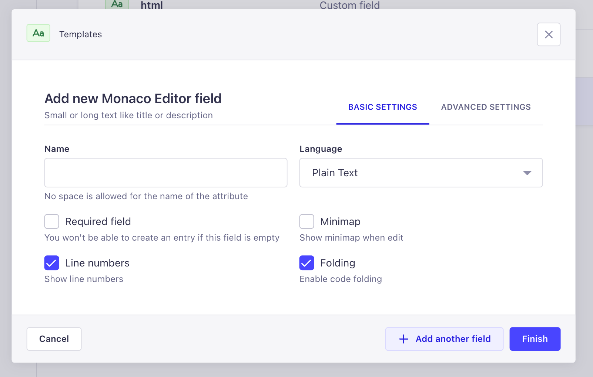
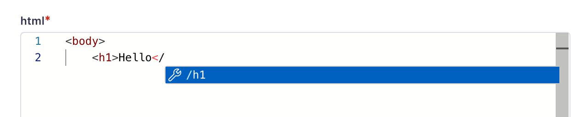

# Monaco Field Editor

## Installation

You need install `strapi-plugin-monaco-editor` and `monaco-editor`.

```bash
#npm
npm install strapi-plugin-monaco-editor monaco-editor

# yarn
yarn install strapi-plugin-monaco-editor monaco-editor

# bun
bun install strapi-plugin-monaco-editor monaco-editor
```

Enable the plugin from strapi configuration: `config/plugins.ts|js`

```ts
export default () => ({
  "monaco-editor": {
    enabled: true
  },
  ...
})
```

Because I cannot bundle `monaco-editor` workers inside the plugin,
you need to use strapi instance to bundle workers correctly 😔.  
(If you have any suggestion please write me! 😉)

Create `src/admin/monaco-editor-workers.ts`

```ts
import * as monaco from "monaco-editor";

// @ts-ignore
import jsonWorker from 'monaco-editor/esm/vs/language/json/json.worker?worker';
// @ts-ignore
import cssWorker from 'monaco-editor/esm/vs/language/css/css.worker?worker';
// @ts-ignore
import htmlWorker from 'monaco-editor/esm/vs/language/html/html.worker?worker';
// @ts-ignore
import jsWorker from 'monaco-editor/esm/vs/language/typescript/ts.worker?worker';
// @ts-ignore
import editorWorker from 'monaco-editor/esm/vs/editor/editor.worker?worker';

const initMonacoEditorWorkers = () => {
  self.MonacoEnvironment = {
    getWorker: function(_, label) {
      switch (label) {
        case 'json':
          return jsonWorker();
        case 'css':
        case 'scss':
        case 'less':
          return cssWorker();
        case 'html':
        case 'handlebars':
        case 'razor':
          return htmlWorker();
        case 'typescript':
        case 'javascript':
          return jsWorker();
        default:
          return editorWorker();
      }
    },
  };
};

export default initMonacoEditorWorkers;
```

Rename `src/admin/app.example.tsx` in `src/admin/app.tsx` and add the `initWorker` call in `bootstrap` function.

```ts
import type { StrapiApp } from '@strapi/strapi/admin';
import initMonacoEditorWorkers from "./monaco-editor-workers";

export default {
  bootstrap(app: StrapiApp) {
    initMonacoEditorWorkers()
  },
};


```

## How to use

After you add the plugin then you can use the `Monaco Editor` custom field



and use the properties to customize the field



When you prompt the code you can use suggestions and intellisense



## How to build

```bash
bun run build
```
